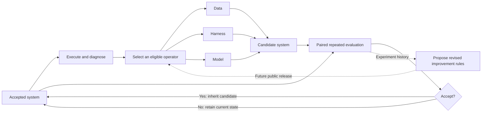

<div align="center">

# Triad-RSI

### Data · Harness · Model

**An open research framework for coordinated recursive self-improvement.**

[](https://github.com/boringKey/Triad-RSI/actions/workflows/tests.yml)
[](LICENSE)


[Quick start](#quick-start) · [Architecture](docs/architecture.md) · [Evaluation](docs/evaluation.md) · [Roadmap](ROADMAP.md) · [中文介绍](docs/README.zh-CN.md)

</div>

Triad-RSI studies how an AI agent system can improve its **training data**, **execution harness**, and **model** within a shared feedback loop—and how experience from that loop can inform better improvement strategies.

**v1 / 0.1.0 is a public core preview.** It releases working scheduling and evaluation components extracted from our research prototype, with an offline example and tests. The full training and benchmark pipeline is not included yet. Development is ongoing; see the [release boundary](docs/release-scope.md) and [changelog](CHANGELOG.md).

## The research question

When an agent fails, should we improve its data, change its execution guidance, or update its training recipe? Can those interventions reinforce one another? Can the system learn to make better improvement decisions over successive cycles?

| Component | Intended intervention |
| --- | --- |
| **Data** | Collect verified trajectories and generate targeted training examples from execution feedback. |
| **Harness** | Revise prompts, workflows, tool-use guidance, and execution strategies. |
| **Model** | Update parameters or training configurations using validated experience. |

We study both the evolving agent system and the rules used to improve it. Demonstrating sustained recursive gains remains a research goal, not a claim of this preview.

## System overview



This diagram describes the research architecture. **This release implements operator scheduling and candidate comparison**, not all boxes of the end-to-end system.

## What works in v1

- **Cost-aware operator policy:** softmax-UCB sampling with exploration and a uniform probability floor.
- **Controlled scheduling:** eligibility, coverage, attempt-balance constraints, and an optional injected proposal callback.
- **Paired selection:** exact task pairing, gain/regression accounting, and configurable acceptance rules.
- **Repeated confirmation:** three runs per side by default, task-wise majority outcomes, and recorded confirmation order.
- **Inspectable receipts:** JSON records of decisions, probabilities, votes, and gate results.
- **Offline demo:** deterministic synthetic replay with no API key, GPU, model download, or runtime dependency.

The demo does **not** generate data, train a model, or reproduce benchmark results.

## Quick start

Requires Python 3.10+.

```bash
git clone https://github.com/boringKey/Triad-RSI.git
cd Triad-RSI
python -m venv .venv
source .venv/bin/activate  # Windows: .venv\Scripts\activate
python -m pip install .
triad-rsi-demo --output artifacts/demo
python -m unittest discover -s tests -v
```

For a source-only run without installation:

```bash
PYTHONPATH=src python -m triad_rsi.demo --output artifacts/demo
```

The demo replays six synthetic iterations, including an improving candidate, an unchanged candidate, and a regressing candidate. It writes:

```text
artifacts/demo/
├── summary.json
└── iteration-000/ ... iteration-005/
    ├── selection.json
    └── confirmation.json
```

Fixtures reset each iteration. Accepted demo outcomes do not imply cumulative learning. See [the walkthrough](examples/README.md).

## Use the core

```python
from triad_rsi import Bandit, gate_from_vectors

policy = Bandit(["data", "harness", "model"])
operator, probabilities = policy.choose(seed=7, eligible=["data", "harness"])

baseline = {("example", "task-1"): False, ("example", "task-2"): True}
candidate = {("example", "task-1"): True, ("example", "task-2"): True}
result = gate_from_vectors(baseline, candidate, acceptance_rule="net_improvement")

# Count the accepted gain; charge cost even when a proposal is rejected.
gain = result["delta"] if result["accepted"] else 0.0
policy.update(operator, performance_gain=gain, cost_units=1.0)
```

This tiny example illustrates the API, not statistical evidence. [Evaluation notes](docs/evaluation.md) explain majority voting, the two gate modes, and why adaptive selection is not held-out evaluation.

## Repository layout

```text
src/triad_rsi/
  bandit.py         Cost-aware operator probabilities
  scheduler.py      Eligibility, coverage, balance, proposal callback
  gate.py           Paired candidate acceptance
  confirmation.py   Repeated evaluations and majority votes
  demo.py           Synthetic offline replay
docs/               Architecture, evaluation, release scope, Chinese overview
examples/           Demo walkthrough
tests/              Core behavior and failure-path tests
```

## Release plan

| Milestone | Status | Scope |
| --- | --- | --- |
| **v1 / 0.1.0** | Current public preview | Scheduling, paired gates, repeated confirmation, demo, tests and documentation. |
| **v2 / 0.2.x** | Planned | Portable operator/backend interfaces, accepted-state persistence and resume support. |
| **v3 / 0.3.x** | Planned | Same-start improvement-rule trials and reproducible held-out evaluation recipes. |

Future milestones are plans, not completed releases. The original experiments' internal iteration numbers are not public version numbers. See [ROADMAP.md](ROADMAP.md).

## Contributing

Reproducible bug reports, evaluation-protocol discussions, and backend integration proposals are welcome. Start with [CONTRIBUTING.md](CONTRIBUTING.md).

## License

The code and documentation in this repository are released under the [MIT License](LICENSE). External models and datasets retain their respective terms.
